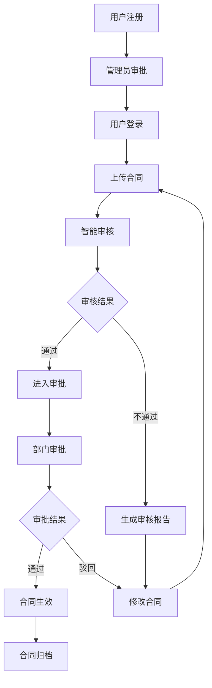
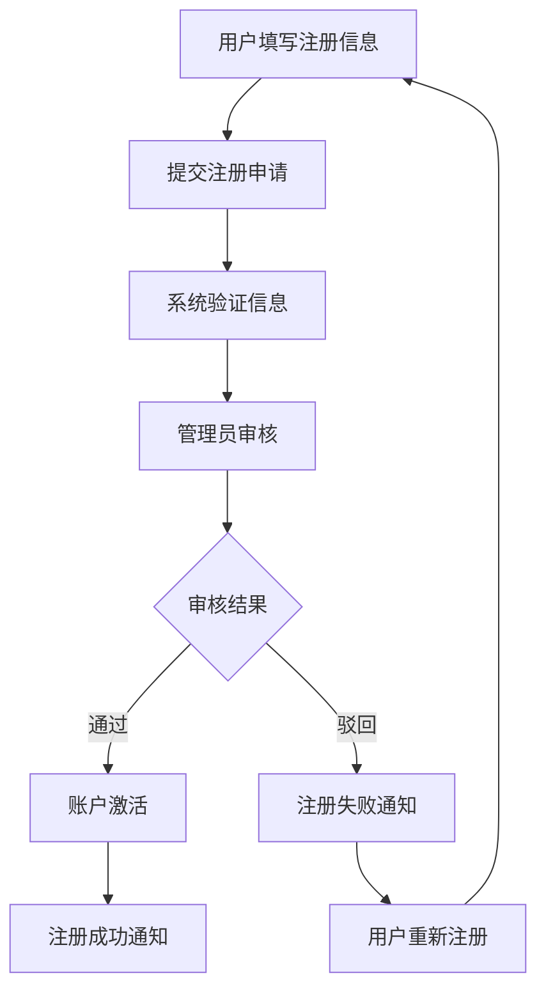
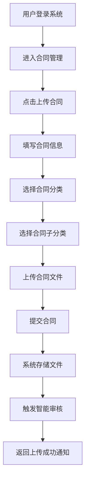
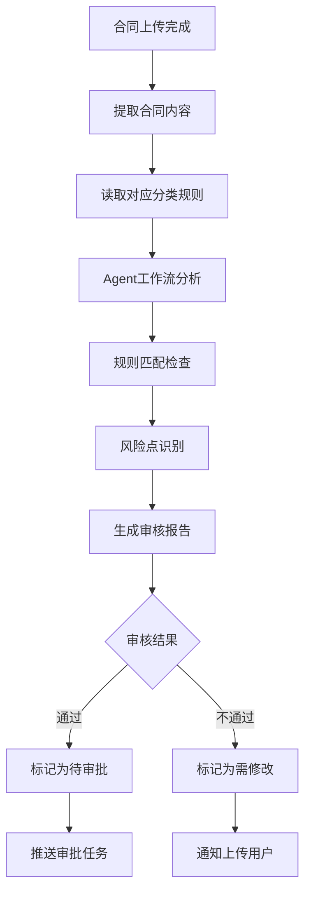
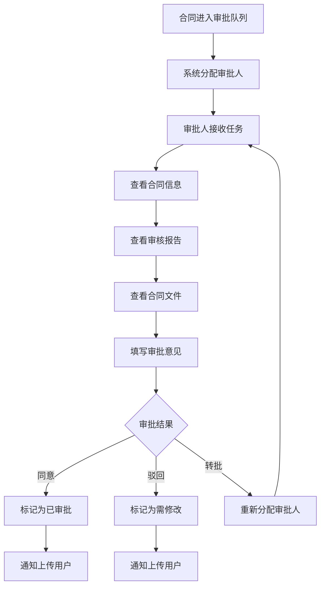
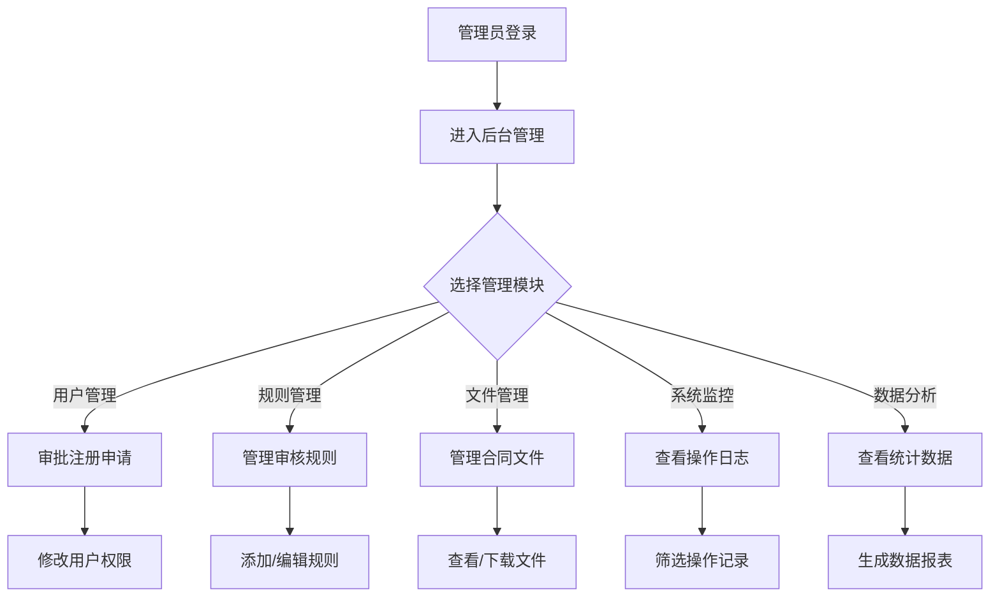
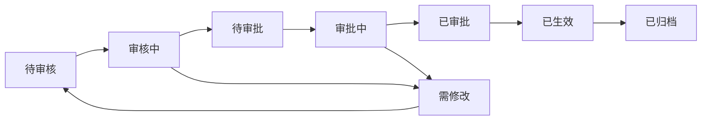
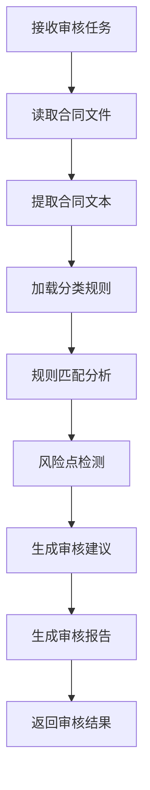
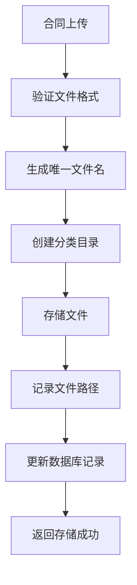
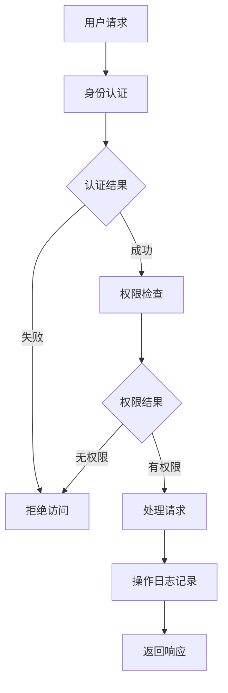

# 合同评审系统流程图

## 1. 系统整体流程图

```mermaid
flowchart TD
    A[用户注册] --> B[管理员审批]
    B --> C[用户登录]
    C --> D[上传合同]
    D --> E[智能审核]
    E --> F{审核结果}
    F -->|通过| G[进入审批]
    F -->|不通过| H[生成审核报告]
    H --> I[修改合同]
    I --> D
    G --> J[部门审批]
    J --> K{审批结果}
    K -->|通过| L[合同生效]
    K -->|驳回| I
    L --> M[合同归档]
```

## 2. 用户注册流程

```mermaid
flowchart TD
    A[用户填写注册信息] --> B[提交注册申请]
    B --> C[系统验证信息]
    C --> D[管理员审核]
    D --> E{审核结果}
    E -->|通过| F[账户激活]
    E -->|驳回| G[注册失败通知]
    F --> H[注册成功通知]
    G --> I[用户重新注册]
    I --> A
```

## 3. 合同上传流程

```mermaid
flowchart TD
    A[用户登录系统] --> B[进入合同管理]
    B --> C[点击上传合同]
    C --> D[填写合同信息]
    D --> E[选择合同分类]
    E --> F[选择合同子分类]
    F --> G[上传合同文件]
    G --> H[提交合同]
    H --> I[系统存储文件]
    I --> J[触发智能审核]
    J --> K[返回上传成功通知]
```

## 4. 智能审核流程

```mermaid
flowchart TD
    A[合同上传完成] --> B[提取合同内容]
    B --> C[读取对应分类规则]
    C --> D[Agent工作流分析]
    D --> E[规则匹配检查]
    E --> F[风险点识别]
    F --> G[生成审核报告]
    G --> H{审核结果}
    H -->|通过| I[标记为待审批]
    H -->|不通过| J[标记为需修改]
    I --> K[推送审批任务]
    J --> L[通知上传用户]
```

## 5. 审批流程

```mermaid
flowchart TD
    A[合同进入审批队列] --> B[系统分配审批人]
    B --> C[审批人接收任务]
    C --> D[查看合同信息]
    D --> E[查看审核报告]
    E --> F[查看合同文件]
    F --> G[填写审批意见]
    G --> H{审批结果}
    H -->|同意| I[标记为已审批]
    H -->|驳回| J[标记为需修改]
    H -->|转批| K[重新分配审批人]
    I --> L[通知上传用户]
    J --> M[通知上传用户]
    K --> C
```

## 6. 后台管理流程

```mermaid
flowchart TD
    A[管理员登录] --> B[进入后台管理]
    B --> C{选择管理模块}
    C -->|用户管理| D[审批注册申请]
    C -->|规则管理| E[管理审核规则]
    C -->|文件管理| F[管理合同文件]
    C -->|系统监控| G[查看操作日志]
    C -->|数据分析| H[查看统计数据]
    D --> I[修改用户权限]
    E --> J[添加/编辑规则]
    F --> K[查看/下载文件]
    G --> L[筛选操作记录]
    H --> M[生成数据报表]
```

## 7. 合同状态流转图

```mermaid
flowchart LR
    A[待审核] --> B[审核中]
    B --> C[待审批]
    B --> D[需修改]
    D --> A
    C --> E[审批中]
    E --> F[已审批]
    E --> D
    F --> G[已生效]
    G --> H[已归档]
```

## 8. AI/Agent工作流流程图

```mermaid
flowchart TD
    A[接收审核任务] --> B[读取合同文件]
    B --> C[提取合同文本]
    C --> D[加载分类规则]
    D --> E[规则匹配分析]
    E --> F[风险点检测]
    F --> G[生成审核建议]
    G --> H[生成审核报告]
    H --> I[返回审核结果]
```

## 9. 文件存储流程图

```mermaid
flowchart TD
    A[合同上传] --> B[验证文件格式]
    B --> C[生成唯一文件名]
    C --> D[创建分类目录]
    D --> E[存储文件]
    E --> F[记录文件路径]
    F --> G[更新数据库记录]
    G --> H[返回存储成功]
```

## 10. 系统安全流程图

```mermaid
flowchart TD
    A[用户请求] --> B[身份认证]
    B --> C{认证结果}
    C -->|成功| D[权限检查]
    C -->|失败| E[拒绝访问]
    D --> F{权限结果}
    F -->|有权限| G[处理请求]
    F -->|无权限| E
    G --> H[操作日志记录]
    H --> I[返回响应]
```